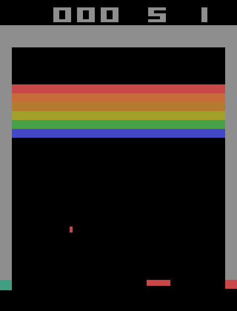

# DQN Breakout - From Scratch

A PyTorch implementation of the Deep Q-Network (DQN) agent for the Atari game **Breakout**, built from scratch without RL libraries. This project follows the architecture and preprocessing standards established in the 2015 Nature paper, *Playing Atari with Deep Reinforcement Learning*.

<p align="center">
  
</p>

---

## 🚀 Getting Started

### Prerequisites
- Python 3.10
- NVIDIA GPU with CUDA (recommended for training; CPU works for simulation)

### Installation

**Option 1: Conda (Linux / server)**
```bash
conda create -n dqn_breakout python=3.10 -y
conda activate dqn_breakout
pip install torch torchvision --index-url https://download.pytorch.org/whl/cu118
pip install gymnasium[atari] ale-py opencv-python numpy pandas matplotlib
```

**Option 2: venv (Windows)**
```powershell
python -m venv venv
venv\Scripts\activate
pip install torch torchvision --index-url https://download.pytorch.org/whl/cu118
pip install gymnasium[atari] ale-py opencv-python numpy pandas matplotlib
```

> For CPU-only (no GPU): replace the torch line with `pip install torch torchvision`

### Running Training
To start a new training run:
```bash
python train.py
```

To resume from a specific checkpoint:
```bash
python train.py --resume logs/<folder>/dqn_breakout.pth --frame <last_frame>
```

---

### Running the Pretrained Model

A pretrained checkpoint is included in `model/`. To watch it play:
```bash
python scripts/simulate_atari.py --model model/dqn_breakout.pth
```

To evaluate it over 30 games (ε=0.05, matching the paper's protocol):
```bash
python scripts/eval_checkpoint.py --model model/dqn_breakout.pth
```

Results are saved to `model/eval_results.json`.


---

## 📁 Project Structure
```
.
├── model/
│   ├── dqn_breakout.pth       # Pretrained checkpoint
│   ├── config.json            # Training configuration
│   └── eval_results.json      # Evaluation results (30 games)
├── src/
│   ├── train.py               # Main training loop and checkpoint management
│   ├── agent.py               # DQNAgent, ReplayMemory, epsilon-greedy policy
│   ├── model.py               # CNN architecture (2015 Nature DQN)
│   ├── preprocessing.py       # Gymnasium wrappers for Atari preprocessing
│   ├── config.py              # Hyperparameters
│   └── utils.py               # Shared utility functions
└── scripts/
    ├── eval_checkpoint.py     # Evaluate a checkpoint over N full games
    └── simulate_atari.py      # Watch the agent play in real time
```